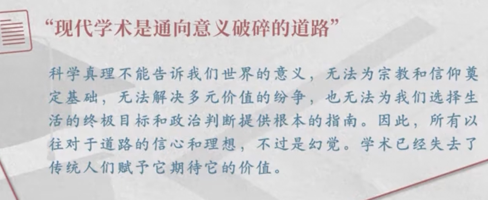

[以学术为业](https://m.aisixiang.com/data/117838-1.html)

- 学术之不可为
	那么，这个在西方文化中已持续数千年的除魅过程，这种科学即隶属于其中，又是其动力的"进步"，是否有着超越单纯的实践和技术层面的意义呢？在列夫?托尔斯泰的著作中，各位可以找到对这一问题最纯净的表达形式。他从十分独特的途径触及这个问题。他的沉思所针对的全部问题，日益沉重地围绕着死亡是不是一个有意义的现象这一疑问。他以为回答是肯定的，而文明人则以为否。文明人的个人生活已被嵌入"进步"和无限之中，就这种生活内在固有的意义而言，它不可能有个终结，因为在进步征途上的文明人，总是有更进一步的可能。无论是谁，至死也不会登上巅峰，因为巅峰是处在无限之中。亚伯拉罕或古代的农人"年寿已高，有享尽天年之感"[12]，这是因为他处在生命的有机循环之中，在他临终之时，他的生命由自身的性质所定，已为他提供了所能提供的一切，也因为他再没有更多的困惑希望去解答，所以他能感到此生足矣。而一个文明人，置身于被知识、思想和问题不断丰富的文明之中，只会感到"活得累"，却不可能"有享尽天年之感"。

	但这里含有另一层意义，即这样的知识或信念：只要人们想知道，他任何时候都能够知道；从原则上说，再也没有什么神秘莫测、无法计算的力量在起作用，人们可以通过计算掌握一切。而这就意味着为世界除魅[11]。人们不必再像相信这种神秘力量存在的野蛮人那样，为了控制或祈求神灵而求助于魔法。技术和计算在发挥着这样的功效，而这比任何其他事情更明确地意味着理智化。

	另一方面，我们每一位科学家都知道，一个人所取得的成就，在10年、20年或50年内就会过时。这就是科学的命运，当然，也是科学工作的真正意义所在。这种情况在其他所有的文化领域一般都是如此，但科学服从并投身于这种意义，却有着独特的含义。每一次科学的"完成"都意味着新的问题，科学请求被人超越，请求相形见绌。任何希望投身于科学的人，都必须面对这一事实。

	教授在课堂上的讨论至此已达到极限，即使如此。生活中的重大问题远未获得解决。但是在这个领域，大学之外的势力却有他们的说法。对于摩西在山上的道德训词[21]，诸如"莫要抵抗恶行"、或再给他另一面脸之类，谁能站出来"科学地加以驳斥"呢？但是以现世的眼光看，有一点是很清楚的：这是在鼓吹一种无尊严的道德。这里，人们要在这种道德所赞扬的宗教尊严，和说法十分不同的人之尊严----"抵抗罪恶，不然你要承担让它横行无阻的责任。"----之间，做出抉择。对于每一个人来说，根据他的终极立场，一方是恶魔，另一方是上帝，个人必须决定，在他看来，哪一方是上帝，哪一方是恶魔。生活中的所有领域莫不如此。

https://youtu.be/ZNSJZzd5yCY?t=2593

祛魅的世界

我们这个时代，因为它所独有的理性化和理智化，最主要的是因为世界已被除魅，它的命运便是，那些终极的、最高贵的价值，已从公共生活中销声匿迹，它们或者遁入神秘生活的超验领域，或者走进了个人之间直接的私人交往的友爱之中。

- 科学的局限
- 事实判断与价值判断
- 意义的丧失
- 价值多元
